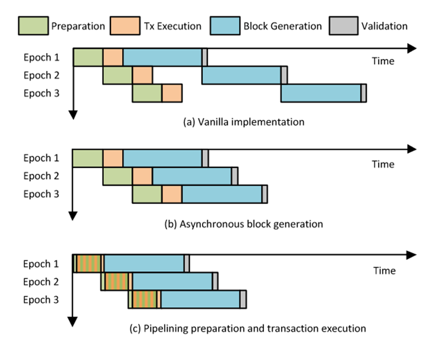
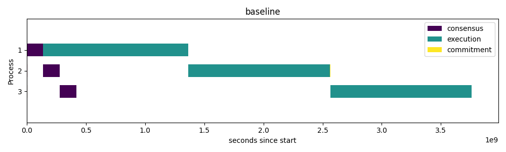
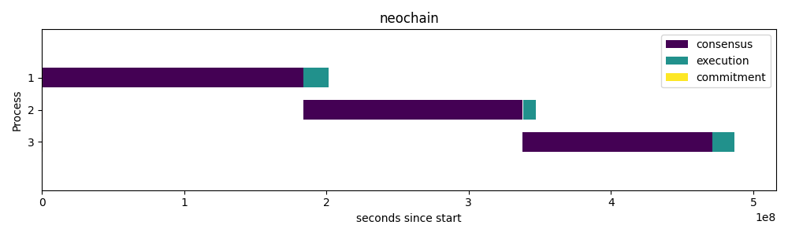

# 大作业报告

杨翌 2023213947

## 选题与背景

选题：面向区块链的高性能任务调度算法实现

参考文献：[Z. Peng et al., “NeuChain: a fast permissioned blockchain system with deterministic ordering,” Proc. VLDB Endow., vol. 15, no. 11, pp. 2585–2598, Jul. 2022, doi: 10.14778/3551793.3551816.](https://dl.acm.org/doi/10.14778/3551793.3551816)

宏观来看，区块链可以理解为 “威胁模型更严格的交易执行引擎”
允许存在一部分恶意节点

- 传统分布式系统节点互相信任，分工执行不同交易，节点越多性能越好（负载均衡）
- 区块链每个节点分别执行相同交易，互相验证，节点越多，共识负担越大，性能可能越差

传统OEV（Ordering-Execution-Validation）执行流程：共识交易（确定一批交易的执行顺序）-》执行这一批交易-》验证并落库

为了保证落库数据一致，所有结点的交易调度必须是确定性的（比如串行），或者只有一个节点负责执行（例如Bitcoiin等公链）

NeuChain实现了一种确定性的并行调度算法，也是本次选题的实现目标

## 算法概述

主要分为四个阶段

- 预准备：通过共识算法，确定下一个块包含哪些交易
- 执行：尽可能并行并处理读写冲突（实现重点）
- 块生成和验证：填充区块的其他字段并落库



重点在于执行阶段的并行执行和冲突处理

- 执行阶段
  - 所有交易根据同一个storage snapshot并行执行，得到读写集
  - 对同一存储位置，只有哈希值最小的交易的写操作会被记录在 Table 中
- 冲突处理阶段
  - 重新检查所有交易，对于同一存储位置，除 Table 中已经被记录的交易，其他交易都被回退，等待在下一个块中被执行


## 算法实现

### 智能合约和虚拟机

智能合约和虚拟机的设计是模拟执行的基础。这里将最简单的汇编代码作为合约代码，以此可以省去编译的步骤。然后通过汇编指令和 Golang 函数映射来实现指令

```go
// NewVM 创建并初始化一个新的执行引擎
func NewVM(cell []byte) *VM {
	e := &VM{
		Context:   NewContext(cell),
		opcodeMap: make(map[string]OpAction),
	}
	e.loadOpcodes()
	return e
}

// loadOpcodes 加载所有操作码及其对应的处理函数
func (e *VM) loadOpcodes() {
	e.opcodeMap["LOAD"] = load
	e.opcodeMap["STOREI"] = storei
	e.opcodeMap["STORE"] = store
	e.opcodeMap["MALLOC"] = malloc
	e.opcodeMap["ADD"] = add
	e.opcodeMap["SUB"] = sub
	e.opcodeMap["MUL"] = mul
	e.opcodeMap["DIV"] = div
	e.opcodeMap["CMP"] = cmp
	e.opcodeMap["JMP"] = jmp
	e.opcodeMap["JEQ"] = jeq
	e.opcodeMap["PUSH"] = push
	e.opcodeMap["DUP"] = dup
	e.opcodeMap["SLEEP"] = sleep
}
```

对应函数示例如下：

```go
func mul(ctx *Context, args []interface{}) error {
	a := ctx.Pop()
	b := ctx.Pop()
	ctx.Push(a * b)
	return nil
}

func div(ctx *Context, args []interface{}) error {
	a := ctx.Pop()
	b := ctx.Pop()
	if a == 0 {
		return errors.New("division by zero")
	}
	ctx.Push(b / a)
	return nil
}
```

最终一个交易是由一系列的汇编指令组成的。示例程序：读取一个位置的内存，根据值的大小对另一个位置写入不同的值（读写依赖）

```go
// Transaction 表示一个交易，包含一系列操作码
type Transaction struct {
	Code      []Opcode `json:"code"`
	RWSetHash string   `json:"rwSetHash"`
}

// NewTransaction 创建并初始化一个新的交易
func NewTransaction(idxFrom int, idxTo int) *Transaction {
	offsetFrom, offsetTo := idxFrom*8, idxTo*8
	return &Transaction{
		Code: []Opcode{
			{"LOAD", []interface{}{uint64(offsetFrom), uint64(8)}}, // 加载内存偏移量0处的8字节数据到堆栈
			{"DUP", nil},                         // 复制堆栈顶部元素
			{"PUSH", []interface{}{uint64(128)}}, // 将100推入堆栈
			{"CMP", nil},                         // 比较堆栈顶部两个元素
			{"SLEEP", nil},
			{"JEQ", []interface{}{9, uint64(0)}}, // 如果val<=100,跳转到第7条指令
			{"PUSH", []interface{}{uint64(2)}},   // 将2推入堆栈
			{"DIV", nil},                         // 将堆栈顶部元素除以2
			{"SLEEP", nil},
			{"JMP", []interface{}{uint64(11)}},  // 跳转到第9条指令
			{"PUSH", []interface{}{uint64(32)}}, // 将20推入堆栈
			{"ADD", nil},                        // 将堆栈顶部两个元素相加
			{"SLEEP", nil},
			{"STORE", []interface{}{uint64(offsetTo)}}, // 将结果存储回内存偏移量0处
		},
	}
}
```

模拟执行：

```go
// ExecuteTransaction 执行给定的交易
func (e *VM) ExecuteTransaction(t *common.Transaction) error {
	e.Context.SetPC(0)
	for e.Context.PC < len(t.Code) {
		if e.Context.PC >= len(t.Code) {
			return errors.New(
                "program counter out of bounds")
		}
		opcode := t.Code[e.Context.PC]
		if op, exists := e.opcodeMap[opcode.Name]; exists {
			err := op(e.Context, opcode.Args)
			if err != nil {
				return err
			}
		} else {
			return errors.New("unknown opcode")
		}
		e.Context.IncrementPC()
	}
	return nil
}
```

### 基于哈希值排序的并行执行和冲突处理

整个算法利用了哈希函数的性质：只要输入相同，哈希值就一定相同。冲突处理原则：发生冲突时，哈希值小的交易优先执行

- 执行阶段：
  - 所有交易根据同一个storage snapshot并行执行，得到读写集
  - 对同一存储位置，只有哈希值最小的交易的写操作会被记录在 Table 中
- 冲突处理阶段
  - 重新检查所有交易，对于同一存储位置，除 Table 中已经被记录的交易，其他交易都被回退，等待在下一个块中被执行

位置：commit/committer.go

```go
func (c *Committer) executeBlock(msg common.CommitMsg) ([]*common.TxDefMsg, []common.TxDefMsg, error, common.Block, *vm.VM) {
	// 准备工作省略...
	engine := vm.NewVM(snapshot)

	successTxs := make([]common.TxDefMsg, 0)
	abortedTxs := make([]*common.TxDefMsg, 0)

	wmap := make(map[int][]byte)
	wg := sync.WaitGroup{}
	wg.Add(len(msg.Batch))
	mu := sync.Mutex{}
	for i, txDef := range msg.Batch {
		go func(localTxDef *common.TxDefMsg, localI int) {
			defer wg.Done()
			selfHash := calTxHash(localI, localTxDef)
			mu.Lock()
			defer mu.Unlock()
			if val, ok := wmap[localTxDef.IdxTo]; !ok || bytes.Compare(val, selfHash) > 0 {
				wmap[localTxDef.IdxTo] = selfHash
			}
		}(txDef, i)
	}
	wg.Wait() // 第一阶段预执行同步
	wg.Add(len(msg.Batch))
	for i, txDef := range msg.Batch {
		go func(localI int, localTxDef *common.TxDefMsg) {
			defer wg.Done()
			selfHash := calTxHash(localI, localTxDef)
			if c.checkConcurrent(wmap, localTxDef, selfHash, abortedTxs) {
				return
			}
			tx := utils.TxDefMsgToTransaction(localTxDef)
			innerErr := engine.ExecuteTransaction(tx)
			if innerErr != nil {
				log.Fatalf("failed to execute transaction: %s", err)
			}
			successTxs = append(successTxs, *localTxDef)
		}(i, txDef)
	}
	wg.Wait() // 第二阶段冲突处理同步
	return nil, successTxs, err, lastBlock, engine
}

func (c *Committer) checkConcurrent(wmap map[int][]byte, localTxDef *common.TxDefMsg, selfHash []byte, abortedTxs []*common.TxDefMsg) bool {
	c.wmapMutex.Lock()
	defer c.wmapMutex.Unlock()
	if val, ok := wmap[localTxDef.IdxTo]; ok && bytes.Compare(val, selfHash) < 0 {
		abortedTxs = append(abortedTxs, localTxDef)
		return true
	}
	if val, ok := wmap[localTxDef.IdxFrom]; ok && bytes.Compare(val, selfHash) < 0 {
		abortedTxs = append(abortedTxs, localTxDef)
		return true
	}
	return false
}
```

### 实验结果

我们将相同架构但没有实现并行调度的版本作为 baseline 进行性能比较实验。在 `baseline` 和 `neochain` 两个目录中，分别执行 `start-cluster.sh` 即可分别运行一个3节点的网络，同时使用交易生成工具（`hammer/hammer.go`）随机发起一批交易。

网络执行日志保存在 `tmp/my-raft-cluster/node{A,B,C}/system.log` 中，将其取出分别重命名为 `system-baseline.log` `system-neochain.log` 放到外层目录中（与Python脚本同级）

使用 `python log_proc.py` 即可自动分析日志，并绘制出两个甘特图。

结果如下：





可见当执行成为系统性能瓶颈时，本文实现的算法可以有效提升系统并行度，进而提升整体吞吐量和响应时间。
